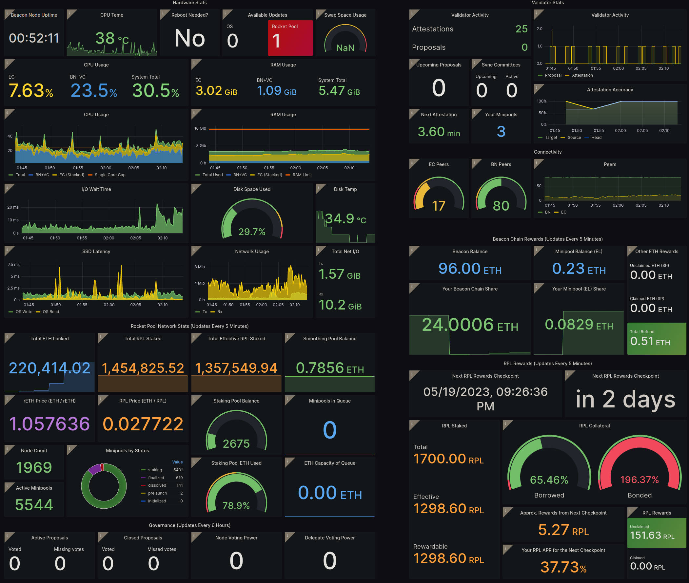

# Why
Now that you have your node up and running, you will probably want to have a convenient way to monitor everything about it at a glance to make sure it's functioning correctly.  

There are many tools out there that do this job. One of the most popular is called Grafana - an easy-to-use, general-purpose dashboard system that you can access with a browser.

<figure></figure>

# How It Works
Prometheus fetch data from your node, and then send these data to grafana

# Goals
Have a central dashboard with every relevant data.

# How to
Firstly, install powertop:
```bash
sudo apt install -y powertop
```

# Additional links
- [Grafana documentation](https://grafana.com/docs/grafana-cloud/send-data/metrics/metrics-prometheus/prometheus-config-examples/noagent_linuxnode/)
- [Prometheus documentation](https://prometheus.io/docs/introduction/overview/)